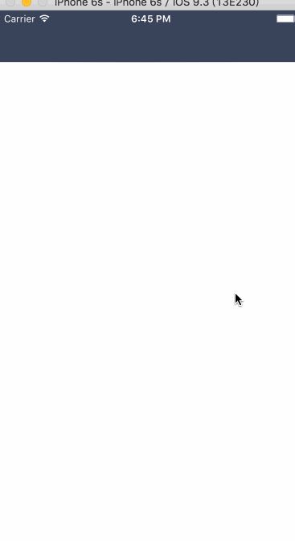

# PanRefresh

### 提要

一个波浪的下拉效果。参照了[Elastic view animation using UIBezierPath](http://iostuts.io/2015/10/17/elastic-bounce-using-uibezierpath-and-pan-gesture/)效果图如下：



涉及到的技术要点：

1. UIBezierPath
2. CADisplayLink

### CADisplayLink

Apple文档对CADisplayLink的描述：

```
A CADisplayLink object is a timer object that allows your application to synchronize its drawing to the refresh rate of the display
```

相比起`NSTimer`，CADisplayLink能更准确的确保在系统的渲染每一帧的时候我们的方法都可以被调用，从而确保了动画的流畅性。但是需要注意的是，iOS是60帧每秒，一桢的时间大概是16.7毫秒，如果动画的计算时间超过这个限制，那么就会出现明显的掉帧。

用法：
```Objective-C
- (void)startDisplayLink 
{ 
    self.displayLink = [CADisplayLink displayLinkWithTarget:self 
                                                   selector:@selector(handleDisplayLink:)]; 
    [self.displayLink addToRunLoop:[NSRunLoop currentRunLoop] 
                           forMode:NSDefaultRunLoopMode]; 
}
  
- (void)handleDisplayLink:(CADisplayLink *)displayLink 
{
  //do something 
}
  
- (void)stopDisplayLink 
{ 
    [self.displayLink invalidate]; 
    self.displayLink = nil; 
}
```

### 实现

我们通过实时更新`CAShapeLayer`的path属性来实现所需要的效果。CAShapeLayer有7个控制点，如下图所示：


path的实现如下：

```Swfit
private func currentPath() -> CGPath {
        let width = view.bounds.width
        
        let bezierPath = UIBezierPath()
        
        bezierPath.moveToPoint(CGPoint(x: 0.0, y: 0.0))
        bezierPath.addLineToPoint(CGPoint(x: 0.0, y: l3ControlPointView.dg_center(animating).y))
        bezierPath.addQuadCurveToPoint(l1ControlPointView.dg_center(animating), controlPoint: l2ControlPointView.dg_center(animating))
        bezierPath.addQuadCurveToPoint(r1ControlPointView.dg_center(animating), controlPoint: cControlPointView.dg_center(animating))
        bezierPath.addQuadCurveToPoint(r3ControlPointView.dg_center(animating), controlPoint: r2ControlPointView.dg_center(animating))
        bezierPath.addLineToPoint(CGPoint(x: width, y: 0.0))
        
        bezierPath.closePath()
        
        return bezierPath.CGPath
    }
```

给当前的View添加一个PanGesture，在拖动的时候更新Path。当滑动结束的时候，我们给控制点添加spring动画，让它们回到原始的位置，同时利用CADisplayLink实时更新对应的Path，这样一来就会出现波浪的效果来。主要实现如下：

```Swift
view.addGestureRecognizer(UIPanGestureRecognizer(target: self, action: #selector(panGestureDidMove)))

displayLink = CADisplayLink(target: self, selector: #selector(updateLayer))
displayLink.addToRunLoop(NSRunLoop.currentRunLoop(), forMode: NSDefaultRunLoopMode)

@objc private func panGestureDidMove(gesture: UIPanGestureRecognizer) {
        if gesture.state == .Ended || gesture.state == .Failed || gesture.state == .Cancelled {
            let centerY = minimumHeight
            
            animating = true
            
            UIView.animateWithDuration(0.9, delay: 0, usingSpringWithDamping: 0.57, initialSpringVelocity: 0, options: [], animations: {
                self.l3ControlPointView.center.y = centerY
                self.l2ControlPointView.center.y = centerY
                self.l1ControlPointView.center.y = centerY
                self.cControlPointView.center.y  = centerY
                self.r3ControlPointView.center.y = centerY
                self.r2ControlPointView.center.y = centerY
                self.r1ControlPointView.center.y = centerY
            }) {
                (finished) in
                self.animating = false
            }
        } else {
            var additionalHeight = max(gesture.translationInView(view).y, 0)
            if additionalHeight > maximumHeight {
                additionalHeight = maximumHeight
            }
            let waveHeight = min(maximumHeight, additionalHeight*0.6)
            let baseHeight = minimumHeight + additionalHeight - waveHeight
        
            let locationX = gesture.locationInView(view).x
            
            layoutControlPoints(baseHeight: baseHeight, waveHeight: waveHeight, locationX: locationX)
            updateLayer()
            
        }
    }

```


